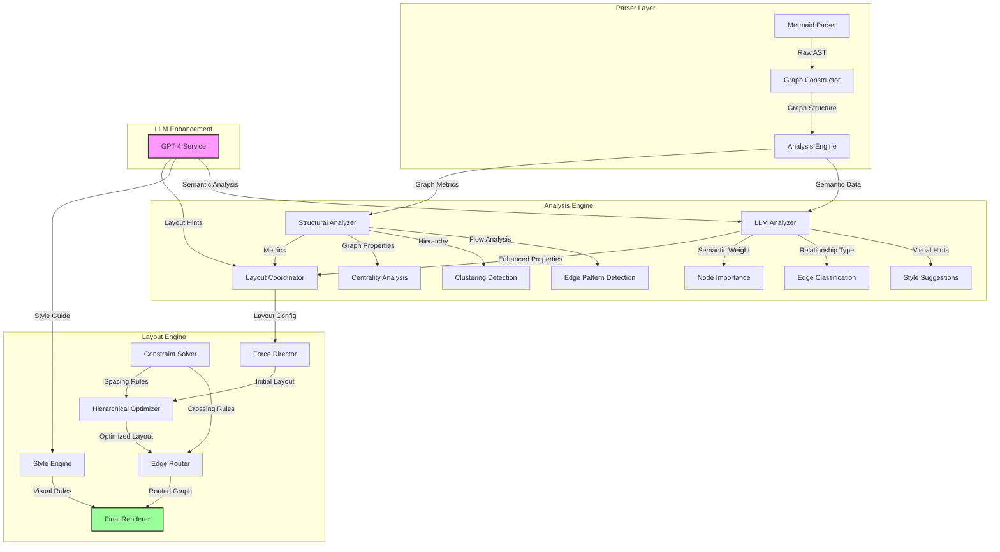
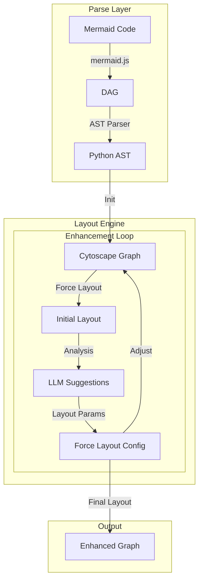

## MuseLayout - Diagram Layout Enhancement Pipeline

This project aims to enhance the layout of Mermaid diagrams using a combination of graph algorithms, LLM (Large Language Model) guidance, and iterative refinement.  The pipeline takes Mermaid code as input and produces an optimized and visually appealing diagram as output.

### 1. Overview

The core layout enhancement pipeline consists of the following stages:

1. **Parsing:** Mermaid code is parsed into a structured representation (DAG - Directed Acyclic Graph).
2. **Graph Construction:** The DAG is converted into a graph data structure suitable for layout algorithms.
3. **Initial Layout:** A force-directed layout algorithm is applied to generate an initial layout.
4. **Enhancement Loop:**  The layout is iteratively refined using LLM suggestions and layout parameter adjustments.
5. **Output:** The final enhanced layout is generated in a suitable format (e.g., SVG, JSON).

### 2. Architecture

1. Detailed Architecture Diagram

2. Layout Pipeline Diagram

### 3.  Key Components and Technologies

* **Mermaid.js (Node.js):**  Used for parsing Mermaid code into a DAG.  A Node.js server exposes an API endpoint for the Python backend to request parsing results.

* **Python Backend (FastAPI):**  Handles the core layout enhancement logic, including communication with the Mermaid parser, LLM interaction, and layout algorithm execution.  FastAPI provides a convenient framework for building the backend API.

* **Cytoscape.js (Python):** The `python-cytoscape` library provides bindings for interacting with Cytoscape.js, a powerful JavaScript library for graph theory and visualization.  Cytoscape.js is used for the force-directed layout algorithm and graph manipulation.

* **LLM (OpenAI API):** The OpenAI API (specifically GPT-4) is used to provide intelligent suggestions for layout improvements.  The LLM receives layout analysis data as input and generates suggestions in JSON format.

### 4.  Layout Enhancement Process

1. **Initial Layout:**  The Cytoscape.js force-directed layout algorithm (`cola` or `cose`) is applied to generate an initial layout of the graph.

2. **Layout Analysis:**  Metrics such as edge crossings, node distribution, and cluster cohesion are calculated to assess the quality of the current layout.

3. **LLM Suggestions:**  The layout analysis data is sent to the LLM via the OpenAI API.  The LLM is prompted to suggest improvements to the layout parameters (e.g., `nodeSpacing`, `edgeElasticity`, `alignmentConstraints`, `relativePlacement`).

4. **Layout Parameter Adjustment:** The LLM suggestions (in JSON format) are parsed, and the layout parameters are adjusted accordingly.

5. **Iterative Refinement:** Steps 2-4 are repeated in a loop, iteratively refining the layout based on LLM feedback. The number of iterations can be fixed or determined dynamically based on layout improvement.

6. **Final Layout Generation:**  The final optimized layout is generated and returned in a suitable format (e.g., SVG, JSON).

### 5. Key Innovations and Features

* **LLM-Guided Layout:**  Leveraging the power of LLMs to provide intelligent layout suggestions.
* **Iterative Refinement:**  Iteratively improving the layout based on LLM feedback and layout analysis.
* **Constraint Handling:**  Supporting alignment and relative placement constraints to enforce desired layout characteristics.
* **Layout Metrics:**  Using concrete metrics to assess layout quality and track improvement.
* **Visualization Debugging:** (Future development)  Integrating visualization tools to debug and analyze the layout process.

### 6. Future Development

* **Interactive Layout Adjustment:** Allowing users to interactively adjust the layout and provide feedback to the LLM.
* **Style Enhancement:**  Integrating LLM-powered style suggestions (e.g., color schemes, fonts).
* **Support for Different Diagram Types:**  Extending the pipeline to support other diagram types beyond graphs (e.g., sequence diagrams, state diagrams).
* **Performance Optimization:** Optimizing the pipeline for performance, especially for large and complex diagrams.
